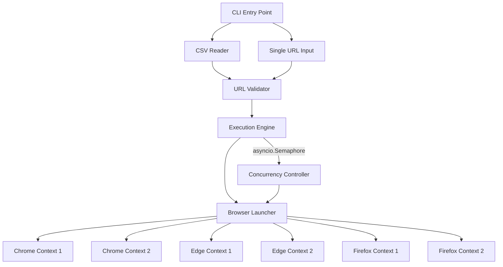
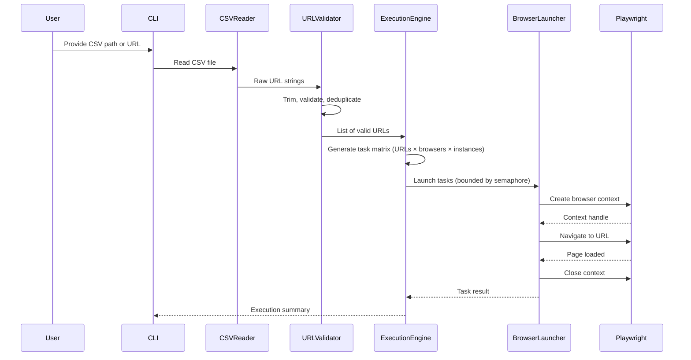

# Design Document: Browser Automation Framework

## Overview

This design describes a production-ready Python browser automation framework that orchestrates cross-browser testing across Chrome, Edge, and Firefox using Playwright for browser control and asyncio for parallel execution. The framework reads target URLs from a CSV configuration file, validates them, and launches isolated browser instances (2 per browser type, 6 total per URL) in parallel with configurable concurrency limits.

The primary architectural goals are:
- **Isolation**: Each browser window runs in its own context with separate cookies, cache, local storage, and session data
- **Parallelism**: All browser instances execute concurrently via asyncio with configurable concurrency limits
- **Resilience**: Individual failures do not halt the overall execution pipeline
- **Simplicity**: CSV-based configuration with sensible defaults

## Architecture



### Layer Decomposition

The framework follows a pipeline architecture with three main layers:

1. **Input Layer** — CSV parsing, URL validation, deduplication
2. **Orchestration Layer** — Asyncio event loop, concurrency control, task distribution
3. **Execution Layer** — Playwright browser lifecycle management, context isolation, navigation

### Data Flow



## Components and Interfaces

### 1. CSVReader

**Responsibility**: Read and parse URL data from CSV files.

```python
class CSVReader:
    def read(self, file_path: str) -> list[str]:
        """
        Read URLs from the first column of a CSV file.
        Skips header row if detected.
        
        Raises:
            FileNotFoundError: If file does not exist
            PermissionError: If file cannot be read
            ValueError: If file contains no valid data rows
        """
        ...
```

### 2. URLValidator

**Responsibility**: Validate URL format, trim whitespace, deduplicate, and return valid URLs.

```python
@dataclass(frozen=True)
class ValidationResult:
    valid_urls: list[str]
    invalid_entries: list[tuple[str, str]]  # (url, reason)

class URLValidator:
    def validate(self, urls: list[str]) -> ValidationResult:
        """
        Validate a list of raw URL strings.
        - Trims whitespace
        - Checks scheme (http/https)
        - Checks hostname format
        - Accepts optional port, path, query, fragment
        - Deduplicates
        
        Returns ValidationResult with valid URLs and invalid entries with reasons.
        """
        ...
    
    def is_valid_url(self, url: str) -> tuple[bool, str]:
        """
        Validate a single URL.
        Returns (is_valid, reason_if_invalid).
        """
        ...
```

### 3. BrowserLauncher

**Responsibility**: Launch browser instances in isolated contexts and navigate to URLs.

```python
from enum import Enum

class BrowserType(Enum):
    CHROMIUM = "chromium"
    EDGE = "edge"
    FIREFOX = "firefox"

@dataclass(frozen=True)
class LaunchResult:
    url: str
    browser_type: BrowserType
    instance_id: int
    success: bool
    error_message: str | None = None
    load_time_ms: float | None = None

class BrowserLauncher:
    LAUNCH_TIMEOUT_MS: int = 30_000
    NAVIGATION_TIMEOUT_MS: int = 60_000
    CONTEXT_CLOSE_TIMEOUT_MS: int = 5_000

    async def launch_browser(
        self, 
        url: str, 
        browser_type: BrowserType, 
        instance_id: int
    ) -> LaunchResult:
        """
        Launch a single browser instance in an isolated context
        and navigate to the given URL.
        
        - Creates a new BrowserContext (isolated cookies, cache, storage, session)
        - Creates a new Page within that context
        - Navigates to URL with NAVIGATION_TIMEOUT_MS timeout
        - Waits for 'domcontentloaded' event
        - Returns LaunchResult with outcome
        - Closes context within CONTEXT_CLOSE_TIMEOUT_MS on completion
        """
        ...
```

### 4. ExecutionEngine

**Responsibility**: Orchestrate parallel browser launches with concurrency control.

```python
@dataclass(frozen=True)
class ExecutionConfig:
    concurrency_limit: int | None = None  # None means unlimited
    browsers_per_url: dict[BrowserType, int] = field(default_factory=lambda: {
        BrowserType.CHROMIUM: 2,
        BrowserType.EDGE: 2,
        BrowserType.FIREFOX: 2,
    })

@dataclass(frozen=True)
class ExecutionSummary:
    total_tasks: int
    successful: int
    failed: int
    results: list[LaunchResult]

class ExecutionEngine:
    def __init__(self, config: ExecutionConfig, launcher: BrowserLauncher):
        ...

    async def execute(self, urls: list[str]) -> ExecutionSummary:
        """
        Execute browser launches for all URLs in parallel.
        
        - Generates task matrix: URLs × browser_types × instances
        - Uses asyncio.Semaphore for concurrency limiting
        - Continues execution if individual tasks fail
        - Returns ExecutionSummary with all results
        """
        ...
    
    def _validate_concurrency_limit(self, limit: int | None) -> None:
        """
        Validate that concurrency_limit is between 1 and 50 if provided.
        Raises ValueError if out of range.
        """
        ...
```

### 5. CLI Entry Point

**Responsibility**: Parse command-line arguments and wire components together.

```python
def main():
    """
    Entry point.
    Accepts:
      --csv <path>       Path to CSV file with URLs
      --url <url>        Single URL to test
      --concurrency <n>  Max simultaneous browser instances (1-50)
    """
    ...
```

## Data Models

### URL Input

| Field | Type | Description |
|-------|------|-------------|
| raw_value | str | Original string from CSV |
| trimmed_value | str | Whitespace-trimmed URL |
| is_valid | bool | Whether URL passed validation |
| failure_reason | str \| None | Reason for validation failure |

### Task Matrix Entry

| Field | Type | Description |
|-------|------|-------------|
| url | str | Validated target URL |
| browser_type | BrowserType | chromium, edge, or firefox |
| instance_id | int | Instance number (0 or 1) |

### Launch Result

| Field | Type | Description |
|-------|------|-------------|
| url | str | Target URL |
| browser_type | BrowserType | Browser that was launched |
| instance_id | int | Instance number |
| success | bool | Whether navigation completed |
| error_message | str \| None | Error details if failed |
| load_time_ms | float \| None | Page load time if successful |

### Execution Summary

| Field | Type | Description |
|-------|------|-------------|
| total_tasks | int | Total browser windows attempted |
| successful | int | Number that completed successfully |
| failed | int | Number that failed |
| results | list[LaunchResult] | Detailed results per task |

## Correctness Properties

*A property is a characteristic or behavior that should hold true across all valid executions of a system — essentially, a formal statement about what the system should do. Properties serve as the bridge between human-readable specifications and machine-verifiable correctness guarantees.*

### Property 1: CSV first-column extraction

*For any* CSV file with N data rows (excluding header) and M columns, the CSVReader SHALL return exactly N strings, each being the value from the first column of the corresponding row.

**Validates: Requirements 1.1**

### Property 2: Deduplication preserves insertion order

*For any* list of URL strings containing duplicates, the deduplication process SHALL return a list containing each unique URL exactly once, in the order of its first occurrence in the input.

**Validates: Requirements 1.2, 2.7**

### Property 3: Whitespace trimming invariant

*For any* valid URL string `u`, and any combination of leading/trailing whitespace characters `ws`, `validate(ws + u + ws)` SHALL produce the same result as `validate(u)`.

**Validates: Requirements 2.1**

### Property 4: URL scheme validation

*For any* URL string, the URL_Validator SHALL accept it only if its scheme component is exactly "http" or "https". For any URL with a scheme other than "http" or "https" (including empty, ftp, file, etc.), the validator SHALL reject it.

**Validates: Requirements 2.2**

### Property 5: URL hostname validation

*For any* string used as a hostname, the URL_Validator SHALL accept it only if it contains exclusively alphanumeric characters, hyphens, and dots, AND contains at least one dot separating a non-empty domain label from a non-empty top-level domain label.

**Validates: Requirements 2.3**

### Property 6: Validation correctly partitions URLs

*For any* list of URL strings, the URL_Validator SHALL partition the list such that: (a) every URL in the valid output has a correct scheme and valid hostname, (b) every URL in the invalid output has a non-empty reason string, and (c) the union of valid and invalid entries (by original URL) equals the deduplicated input set.

**Validates: Requirements 2.4, 2.5, 2.6**

### Property 7: Invalid browser type produces error

*For any* string that is not one of "chromium", "edge", or "firefox", the Browser_Launcher SHALL return an error message that contains all three supported browser type names.

**Validates: Requirements 3.6**

### Property 8: Task matrix invariant

*For any* list of N valid URLs (N ≥ 1), the Execution_Engine SHALL generate a task matrix containing exactly N × 6 entries, with each URL assigned exactly 2 chromium tasks, 2 edge tasks, and 2 firefox tasks.

**Validates: Requirements 4.4, 7.1, 7.2**

### Property 9: Concurrency limit enforcement

*For any* concurrency limit L (where 1 ≤ L ≤ 50) and any number of tasks, the Execution_Engine SHALL never have more than L tasks executing simultaneously at any point during execution.

**Validates: Requirements 6.3, 7.3**

### Property 10: Failure isolation

*For any* set of tasks where a subset fails, the Execution_Engine SHALL still execute all remaining non-failing tasks to completion, and the execution summary SHALL contain results for every task (both successful and failed).

**Validates: Requirements 6.5, 7.4**

### Property 11: Invalid concurrency limit rejection

*For any* integer value less than 1 or greater than 50 provided as a concurrency limit, the Execution_Engine SHALL raise a ValueError with a message indicating the valid range.

**Validates: Requirements 6.6**

## Error Handling

### Error Categories

| Category | Component | Behavior |
|----------|-----------|----------|
| File not found | CSVReader | Raise `FileNotFoundError` with file path |
| File unreadable | CSVReader | Raise `PermissionError` or `IOError` with details |
| No valid URLs | URLValidator | Raise `ValueError` after validation completes |
| Invalid URL format | URLValidator | Log warning, skip URL, continue processing |
| Invalid browser type | BrowserLauncher | Raise `ValueError` listing supported types |
| Browser launch timeout | BrowserLauncher | Log error, return failed `LaunchResult`, continue |
| Navigation timeout | BrowserLauncher | Log error, close context, return failed `LaunchResult` |
| Context creation failure | BrowserLauncher | Log error, return failed `LaunchResult`, continue |
| Invalid concurrency limit | ExecutionEngine | Raise `ValueError` with valid range message |
| Task failure during execution | ExecutionEngine | Log error, continue remaining tasks |

### Error Propagation Strategy

- **Fatal errors** (file not found, no valid URLs, invalid config) halt execution immediately and report to the user
- **Non-fatal errors** (individual URL validation failures, browser launch failures, navigation timeouts) are logged and execution continues for remaining items
- All errors include contextual information: component name, affected URL/browser, and a human-readable reason

### Logging

The framework uses Python's `logging` module with structured log messages:
- `ERROR` — Fatal failures that halt execution or non-fatal failures for individual tasks
- `WARNING` — Skipped items (invalid URLs, failed browser instances)
- `INFO` — Normal execution flow (task start/complete, summary)
- `DEBUG` — Detailed execution state (semaphore acquisition, context lifecycle)

## Testing Strategy

### Unit Tests

Unit tests cover specific examples and edge cases:

- **CSVReader**: Empty file, single-row file, file with header only, file with special characters in URLs
- **URLValidator**: Specific invalid URLs (missing scheme, invalid hostname chars, empty string), valid URLs with all optional components
- **BrowserLauncher**: Invalid browser type error message content
- **ExecutionEngine**: Zero URLs, single URL, concurrency limit boundary values (0, 1, 50, 51)

### Property-Based Tests

Property tests verify universal correctness properties using [Hypothesis](https://hypothesis.readthedocs.io/) (Python PBT library):

- **Library**: Hypothesis
- **Minimum iterations**: 100 per property
- **Tag format**: `Feature: browser-automation-framework, Property {N}: {description}`

Each of the 11 correctness properties defined above will be implemented as a property-based test:

1. CSV extraction — generate random CSV data, verify first-column extraction
2. Deduplication — generate lists with duplicates, verify order-preserving uniqueness
3. Whitespace trimming — generate valid URLs with random padding, verify equivalence
4. Scheme validation — generate URLs with random schemes, verify http/https acceptance
5. Hostname validation — generate random hostnames, verify character/dot rules
6. Validation partitioning — generate mixed valid/invalid URLs, verify correct partition
7. Invalid browser type — generate random non-matching strings, verify error content
8. Task matrix — generate random URL counts, verify N×6 matrix structure
9. Concurrency — generate random limits and task counts, verify max concurrent never exceeds limit
10. Failure isolation — generate random failure patterns, verify all tasks get results
11. Invalid concurrency limit — generate out-of-range integers, verify rejection

### Integration Tests

Integration tests verify Playwright interaction and real browser behavior:

- Launch each browser type (Chrome, Edge, Firefox) and navigate to a test URL
- Verify browser context isolation (cookies, cache, local storage, session)
- Verify timeout behavior (30s launch, 60s navigation, 5s cleanup)
- Verify parallel execution with real asyncio event loop
- End-to-end test: CSV → validate → launch → results

### Test Execution

```bash
# Unit + property tests
pytest tests/ -v --hypothesis-seed=0

# Integration tests (requires browsers installed)
pytest tests/integration/ -v -m integration

# All tests
pytest tests/ -v
```

